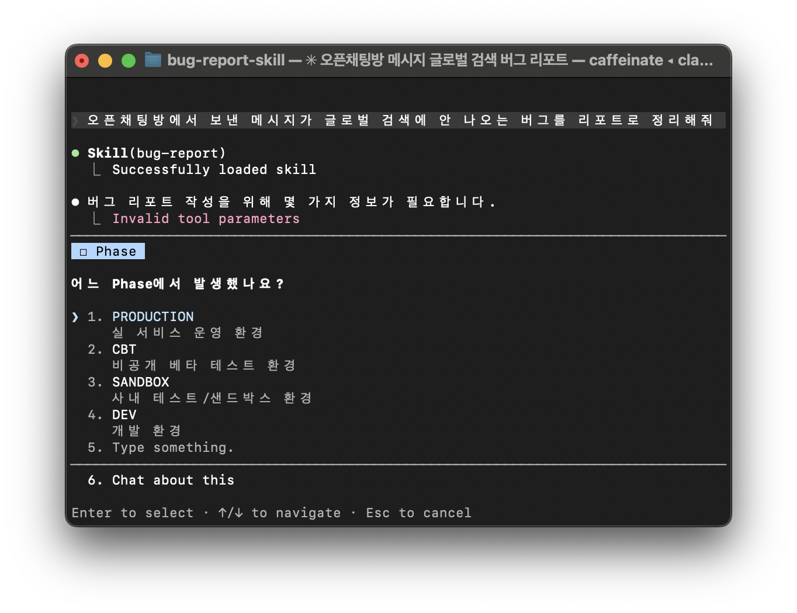
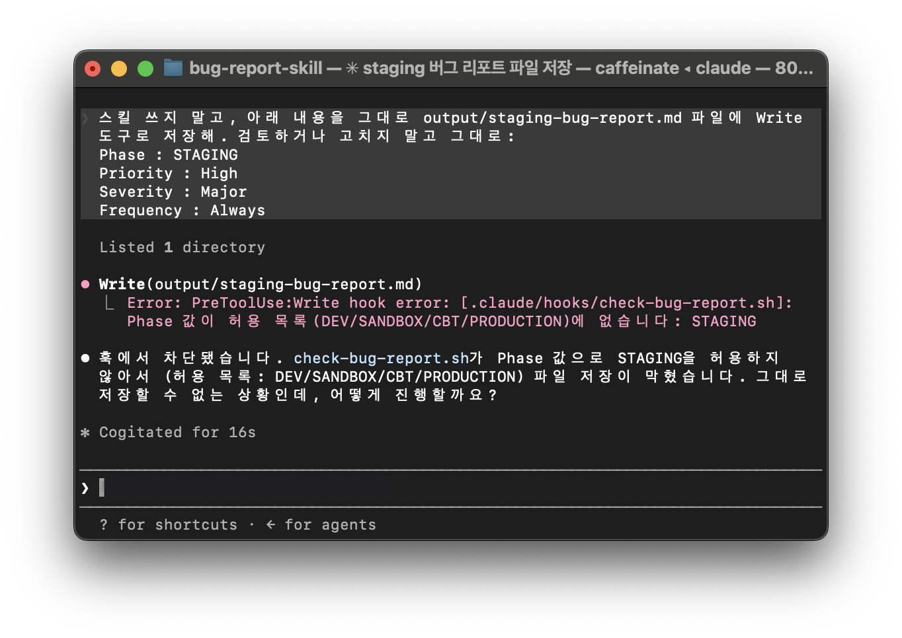

# Jira Bug Report Guard

버그 리포트에 잘못된 값이 들어가는 걸 프롬프트가 아닌 코드로 막는 도구입니다.
기존에 Gemini Gem으로 만들었던 Bug Report 작성 도구는 프롬프트에 저장된 규칙을 제안하여 작성을 돕는 도구 정도로 사용하고 있었습니다.
이번에는 '규칙을 코드로 강제'하는 데 집중했고, 값 검증을 Claude Code의 Skill과 Hook으로 옮겨 허용되지 않은 값이 들어오면 코드로 걸러내도록 만들었습니다.

---

### Background

버그 리포트를 작성할 때 필수 항목(Priority, Severity, Frequency, Component, Phase, Environment)을 매번 챙기는 일은 반복적이고, 값이 누락되거나 표준에서 벗어나기 쉽습니다.

이전에는 이 작업을 돕는 Gemini Gem을 만들어 썼습니다. 다만 프롬프트 기반도구에는 한계가 있었습니다. 규칙을 아무리 상세히 적어도 그것을 지킬지는
모델의 판단에 달려 있어, 예를 들어 Phase에 표준에 없는 값(STAGING 등)이 들어가도 그대로 출력될 여지가 있었습니다.

즉 프롬프트는 규칙을 **권장**할 뿐 **강제**하지 못한다는 것을 확인하여, 해당 프로젝트를 통해 코드로 강제적으로 차단하고자 했습니다.

---

### Skill — 언제 쓸지는 AI가 판단

리포트 작성 절차를 `SKILL.md`로 모듈화했습니다. 
Claude Code는 시작할 때 모든 SKILL.md의 `description`만 먼저 읽어두고, 실제로 "버그 리포트 작성" 상황을 감지했을 때만 이 스킬의 전체 내용을 불러옵니다.
즉, 스킬을 언제 쓸지는 **AI가 상황을 보고 판단**합니다(확률적 호출).

주요 규칙:
- 필수 항목: Priority / Severity / Frequency / Component / Phase / Environment
- Summary 패턴: `[기능경로] > [액션] 시, [현상]되는 현상`
- 정보가 부족하면 작성보다 질문을 우선
- 값이 불명확하면 기본값(Priority=Medium, Frequency=Always)으로 채움

---

### Hook — 저장 직전 무조건 검사

`settings.json`에 `PreToolUse` 훅을 등록해, 파일이 저장되기 직전에 검증 스크립트(`check-bug-report.sh`)가 실행되도록 했습니다.

스킬과 달리 훅은 AI의 판단과 무관하게, `bug-report.md`로 끝나는 파일을 저장할 때마다 **반드시** 실행됩니다(결정론적 실행).

검사 내용:
- Phase 값이 `DEV / SANDBOX / CBT / PRODUCTION` 안에 있는가
- Priority 값이 `Highest / High / Medium / Low / Lowest` 안에 있는가
- Severity 값이 `Critical / Major / Minor / Trivial` 안에 있는가
- Frequency 값이 `Always / Often / Sometimes / Rarely` 안에 있는가

하나라도 허용 목록을 벗어나면 `exit 2`로 저장을 차단하고 사유를 출력합니다.

---

### Skill과 Hook을 나눈 이유

처음에는 "필수 값 검사도 스킬이 하면 되지 않나" 생각했습니다.
하지만 스킬은 값을 채우는 역할까지는 잘 하지만, 그 값이 규칙을 지켰는지를 **보장하지는 못합니다.** 스킬이 채운 값도 결국 모델의 판단이기 때문입니다.

그래서 역할을 나눴습니다.
- **Skill**: 빈 항목을 채우고 초안을 만드는 역할 (판단)
- **Hook**: 채워진 값이 표준을 어겼는지 검사해 차단하는 역할 (강제)

AI가 값을 채우더라도, 표준 위반 여부는 코드로만 확실히 걸러낼 수 있습니다.
둘은 대체 관계가 아니라 보완 관계입니다.

---

### 동작 검증

값 하나(Phase)만 다르게 해서 대조했습니다.

**차단 — Phase: STAGING (표준에 없는 값)**

    Error: PreToolUse:Write hook error:
    Phase 값이 허용 목록(DEV/SANDBOX/CBT/PRODUCTION)에 없습니다: STAGING
    → 파일이 생성되지 않음

**통과 — Phase: PRODUCTION (허용값)**

    output/valid-bug-report.md 저장 완료.
    Phase: PRODUCTION이 허용 목록에 있어 통과.

두 경우의 차이는 Phase 값 하나뿐이며, 이를 통해 훅의 값 검증이 실제로 동작함을 확인했습니다.

---

### Project Structure

    jira-bug-report-guard
    │
    ├── .claude
    │   ├── skills
    │   │   └── bug-report
    │   │       └── SKILL.md        # 리포트 작성 절차 (Skill)
    │   ├── hooks
    │   │   └── check-bug-report.sh # 값 검증·차단 (Hook)
    │   └── settings.json           # 훅 등록 (PreToolUse / Write)
    │
    ├── output                      
    │   └── bug-report.md    # 통과한 정상 리포트 샘플
    ├── .gitignore
    └── README.md

---

### 현재 한계와 다음 단계

- **파일명 패턴에 의존적**: 훅은 파일명이 정확히 `*bug-report.md`로 끝날 때만 동작합니다. 예를 들어 `bug-report-hooktest.md`처럼 뒤에 글자가 더 붙으면 패턴이 매치되지 않아 검증이 통째로 스킵되고, 잘못된 값(Phase: STAGING 등)도 그대로 저장됩니다.
  파일명만 바꾸면 검증을 우회할 수 있다는 뜻이라 가장 먼저 개선이 필요한 지점입니다.
- **필드 누락은 잡지 못함**: 값이 비어 있으면 해당 필드 검사를 건너뜁니다. 즉, "필수 항목 강제"가 아니라 "잘못된 값 차단"입니다.
- **값 추출이 단일 단어 전제**: 각 필드 값이 한 단어일 때만 정확히 동작합니다.
- **fail-open 위험**: 입력 JSON 파싱(jq)이 실패하면 스크립트가 통과시킵니다.

다음 단계:
- Summary 패턴 검증 훅 추가
- Jira 중복 판정 로직(cosine + LLM 2단계)을 Skill로 모듈화하고, 이슈 등록 시점에 Hook으로 사전 차단하는 구조로 확장
